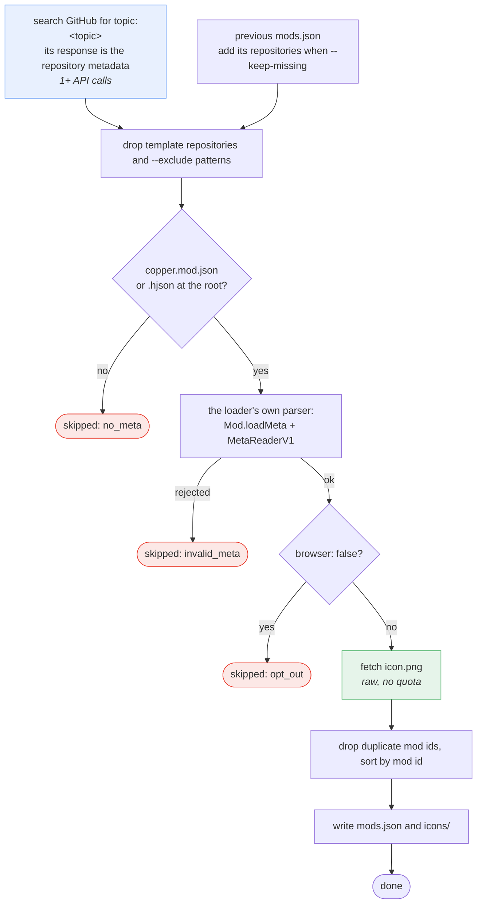

# copper-mods

[English](README.md) | [简体中文](README.zh_CN.md)

Automatically compiles a list of Copper mods into `mods.json`, for launchers and mod browsers to read.
Refreshes once a day from GitHub Actions.

Modelled on [Anuken/MindustryMods](https://github.com/Anuken/MindustryMods), which does the same job for
vanilla Mindustry mods.

**Do not make PRs adding your mod to this list** — make sure your repository fits the criteria below and
it will be picked up on the next scan.

## Criteria

- Must contain a valid **`copper.mod.json`** or **`copper.mod.hjson`** at the **root** of the repository
  (not under `assets/`). This is the file the loader itself looks for, so a mod that is not laid out that
  way cannot be installed by Copper either.
- Must carry the **`mindustry-copper-mod`** topic.
- Must be **public and not archived**.
- Must not be a **template repository**, and must not be one of the known template/example repositories
  (`MDTCopper/mod-template`, `Anuken/ExampleMod`, and the like). A template carries a valid meta file -
  often with the same mod id as the real mod - so indexing one would both list a mod nobody can install
  and, because duplicate ids are resolved by stars, could displace the real mod.

Hidden mods (`"hidden": true`) **are** listed. `hidden` means the mod registers no game content - it is a
plugin, in the loader's terms - so leaving it out would hide working mods. The flag itself is not recorded
in the index: whether a mod registers content is something the loader decides at install time.

A template repository is detected two ways, because GitHub's `is_template` flag is opt-in and most
templates never set it: the flag itself, and an exclude list of known names. Extend it with
`--exclude` (repeatable, `*` and `?` allowed) or index templates anyway with `--keep-templates`.

The metadata is parsed with the **loader's own parser**, not a reimplementation, so anything the loader
would reject at startup is rejected here too and the mod is skipped.

### Releases

The index does **not** look at releases at all. A client asks GitHub for
`/repos/<repo>/releases` itself and picks the build that suits the game version it runs - the same split
`Anuken/MindustryMods` uses. What the index publishes for gating that choice is `gameRequirement`, the
version range your `copper.mod.json` declares:

```json
"dependencies": { "mindustry": ">=159", "loader": ">=0.2.0" }
```

- `gameRequirement` is that `mindustry` filter, verbatim, so a client evaluates it with the loader's own
  `SemanticVersionFilter`. Omit it and the mod is listed as accepting any game version.
- `loaderRequirement` is the `loader` filter, since Copper versions the loader separately.
- `version` is the version in your `copper.mod.json` at the scanned commit. Bump it when you release, or
  clients cannot tell an update is available.

### Opting out

To stay out of the browser without changing what the loader does, add `browser: false` to the `extra`
object of your `copper.mod.json`. The loader and the game both ignore `extra` fields they do not know, so
this is invisible to them:

```json
{
  "version": 1,
  "meta": {
    "id": "example:examplemod",
    "name": "Example Mod",
    "author": "Example",
    "version": "1.0.0",
    "main": "example.examplemod.ExampleMod",
    "extra": { "browser": false }
  }
}
```

`hidden: true` does not keep a mod out of the index - see the criteria above.

## Using the index

```
https://raw.githubusercontent.com/MTDCopper/copper-mods/main/mods.json
```

`mods.json` is an object with a header and a `mods` array; see [docs/mods.schema.md](docs/mods.schema.md)
for every field. An entry is just metadata - no release, no download URL:

```json
{
  "repo": "example/examplemod",
  "id": "example:examplemod",
  "vanillaName": "copper-example-examplemod",
  "name": "Example Mod",
  "author": "Example",
  "version": "1.2.3",
  "gameRequirement": ">=159",
  "loaderRequirement": ">=0.2.0"
}
```

`gameRequirement` is the game version range the mod accepts, written as a **Copper version filter** so a
client can evaluate it with the loader's own `SemanticVersionFilter` before installing anything.
Dependencies, conflicts, mixin counts, the `hidden` flag and all release information are left out: the
loader enforces the first three at install time, and resolving a release is the client's job.

Icons are read from the repository (`icon.png`, else `assets/icon.png`), one raw request each, never from
a release asset. They are published under `icons/` - this is the output directory, not a cache, and it is
rewritten each run - named `<owner>_<repo>.png`, and referenced by `mods[].iconHash` (upper-case SHA-256 of
the file). Repositories with neither path have no `iconHash`.

## Running it

```bash
# the checks that need no network: parsing through the loader, rate-limit policy, exclusions, index shape
# (they live in src/test, so they are not in the jar and not reachable from Main)
./gradlew selfcheck

# a scan (needs network)
GITHUB_TOKEN=... ./gradlew update -Pargs="--out . --keep-missing"

# check a mod the way the loader does, before publishing it
./gradlew validate -Ptarget=../mod-templete
```

`./gradlew run --args="..."` takes the same flags; `./gradlew run --args="--help"` lists them.

`./gradlew jar` builds a self-contained `build/libs/loader-mods-0.1.0.jar`, which is what CI or a hook
should use if the exit code matters: `validate` exits `3` for a mod the loader rejects, and Gradle's
`JavaExec` reports any non-zero exit as its own failure, hiding which one it was.

A token is optional but recommended: anonymous GitHub access allows 60 requests an hour, a token 5000.

### Flags

| Flag | Default | Meaning |
| ---- | ------- | ------- |
| `--out <dir>` | `.` | where `mods.json` and `icons/` are written |
| `--topic <name>` | `mindustry-copper-mod` | discovery topic |
| `--max-pages <n>` | `10` | search pages to read, 100 repositories each. Clamped to 10: see below |
| `--min-stars <n>` | `0` | only fetch icons for repositories with at least this many stars |
| `--keep-missing` | off | keep entries whose repository is no longer discoverable |
| `--allow-empty` | off | permit writing an index with no mods |
| `--keep-templates` | off | index template repositories instead of skipping them |
| `--exclude <owner/repo>` | — | skip a repository; repeatable, `*` and `?` allowed |
| `--token <token>` | `$GITHUB_TOKEN` | GitHub token |
| `--threads <n>` | `8` | concurrent repository scans |
| `--verbose` | off | log every skipped repository and every request |

## How it works



A repository found by topic costs **no API requests at all**: the search response already carries every
repository field the scan needs (`default_branch`, `stars`, `pushed_at`, `archived`, `is_template`), and
the meta file and icon come from `raw.githubusercontent.com`, which is not rate limited like the API. The
releases API is never called, because the index publishes no release data.

Two details worth knowing:

- **The loader parses the metadata.** `copper.loader.mod.MetaMod` is a subclass of the loader's `Mod`,
  placed in the loader's own package so it can call the package-private constructor, and it runs
  `Mod.loadMeta` and `MetaReaderV1` unchanged. Metadata fetched over HTTP is handed to the loader as an
  in-memory resource, so no temporary file is ever written.
- **A failed scan never empties the index.** If discovery returns nothing and there is no previous index
  to fall back on, the run fails instead of publishing an empty list; `--allow-empty` overrides that.

### API quota

The scan is built to spend as little of the API quota as possible, because that is what actually keeps it
running rather than any throttling. Every request it can make:

| Request | When | Counts against the quota |
| ------- | ---- | ------------------------ |
| `/search/repositories?q=topic:<topic>` | up to 10 times per scan, 100 repositories each | yes |
| `/repos/{repo}` | only for repositories that came from the previous index | yes |
| `raw/.../copper.mod.json` | per repository | no |
| `raw/.../icon.png` | per repository with an icon | no |

Every run fetches live: there is no response cache, so a scan always sees the current state of GitHub at
the cost of the requests above.

### The 1000-result ceiling

GitHub's search API returns **at most 1000 results per query**, and **at most 100 per page** - both are
documented limits, not choices. So ten pages is every result there is, and `--max-pages` is clamped to
`10`; asking for more cannot reach more.

That ceiling is why the previous `mods.json` is read and merged in, which is also how
`Anuken/MindustryMods` grew past it: a repository that falls out of the search - because newer
repositories pushed it past result 1000, or because a topic was dropped - keeps its entry instead of
disappearing. `--keep-missing` controls that; without it, entries the search no longer returns are dropped.

- **The search response is the repository metadata.** One `/search/repositories` call returns every field
  the scan needs (`default_branch`, `stars`, `pushed_at`, `archived`, `is_template`), which is why a
  topic-discovered repository needs no `/repos/{name}` request at all.
- **A token is still worth it**, for the search calls and for the repositories that do need a lookup:
  `GITHUB_TOKEN` in Actions allows 1000 requests per hour per repository, while anonymous access allows
  60 per hour per IP.

When GitHub does push back, the retry policy follows its documented order of preference: honour
`retry-after`, else wait out an exhausted primary quota for `x-ratelimit-reset`, else back off at least a
minute (doubling, capped). A wait longer than two minutes is refused, and the run fails with a message
naming the limit - a scheduled run should come back later rather than hold a runner for an hour. Requests
in flight are capped as well, so raising `--threads` cannot exceed GitHub's concurrency limit.

### Loader version

The loader release the metadata is parsed with is one property in `build.gradle`, recorded in the jar and
published as `loaderVersion` in `mods.json`:

```groovy
ext { loaderVersion = findProperty('loaderVersion') ?: '810afee77f' }
```

Bumping it is the only change needed when the loader's meta format moves. To try a locally built loader
before it is published, install it under that coordinate and build with `-PloaderVersion=<commit>`;
`mavenLocal()` is on the repository list for exactly that.

## Layout

| Path | What it is |
| ---- | ---------- |
| `src/main/java/copper/loader/` | the loader-package integration (`MetaMod`, `MetaContainer`) |
| `src/main/java/copper/loadermods/meta/` | the index's view of a mod's metadata |
| `src/main/java/copper/loadermods/index/` | discovery, scanning, `mods.json` |
| `src/main/java/copper/loadermods/net/` | GitHub access with caching and rate-limit handling |
| `src/main/java/copper/loadermods/cli/` | `update`, `validate` |
| `src/test/java/copper/loadermods/SelfCheck.java` | the checks that need no network (test code, not in the jar) |
| `docs/mods.schema.md` | every field of `mods.json` |
| `docs/mods.schema.zh_CN.md` | the same, in Chinese |
