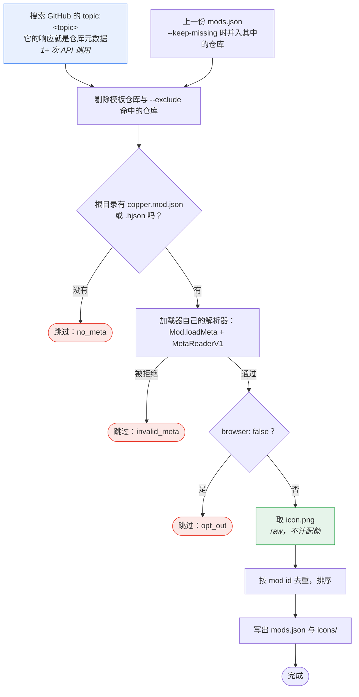

# copper-mods

[English](README.md) | [简体中文](README.zh_CN.md)

自动把 Copper 模组汇总成 `mods.json`，供启动器与模组浏览器读取。由 GitHub Actions 每天刷新一次。

对标 [Anuken/MindustryMods](https://github.com/Anuken/MindustryMods)——它为原版 Mindustry 模组做同样的事。

**不要提 PR 把你的模组加进这个列表** —— 只要你的仓库满足下面的收录标准，下一次扫描就会自动收录。

## 收录标准

- 仓库**根目录**必须有合法的 **`copper.mod.json`** 或 **`copper.mod.hjson`**（不能放在 `assets/` 下）。
  这正是加载器自己查找的文件，所以不符合这个布局的模组 Copper 也装不上。
- 必须带有 **`mindustry-copper-mod`** topic。
- 必须是**公开且未归档**的仓库。
- 不能是**模板仓库**，也不能是已知的模板/示例仓库（`MDTCopper/mod-template`、`Anuken/ExampleMod` 之类）。
  模板仓库带着合法的元数据文件——而且常常和真实模组用同一个 mod id——收录它既会列出一个没人能安装的模组，
  又会因为重复 id 按 star 数决胜而把真实模组挤掉。

隐藏模组（`"hidden": true`）**会被收录**。`hidden` 的含义是"不注册任何游戏内容"，也就是加载器语义里的插件，
漏掉它们反而会把能正常工作的模组藏起来。但这个标记本身不写入索引：模组是否注册内容，由加载器在安装时判定。

模板仓库有两条识别路径，因为 GitHub 的 `is_template` 标记是可选的、多数模板仓库根本不会开：
该标记本身，以及一份已知名字的排除表。用 `--exclude`（可重复，支持 `*` 与 `?`）扩充它，
或用 `--keep-templates` 反过来把模板也收录进来。

元数据是用**加载器自己的解析器**解析的，不是重新实现一遍，所以加载器启动时会拒绝的东西这里同样会被拒绝，
该模组会被跳过。

### 发行版

索引**完全不看 release**。客户端自己去问 GitHub 的 `/repos/<repo>/releases`，
挑出适合自己所运行游戏版本的构建——与 `Anuken/MindustryMods` 的分工一致。
索引为这个选择提供的判据是 `gameRequirement`，也就是你在 `copper.mod.json` 里声明的版本范围：

```json
"dependencies": { "mindustry": ">=159", "loader": ">=0.2.0" }
```

- `gameRequirement` 就是那条 `mindustry` 过滤条件，原样发布，客户端用加载器自己的
  `SemanticVersionFilter` 求值即可。不写就表示接受任意游戏版本。
- `loaderRequirement` 是 `loader` 的过滤条件，因为 Copper 的加载器与游戏是分开版本化的。
- `version` 是被扫描的那次提交里 `copper.mod.json` 声明的版本。发版时记得改它，否则客户端无法察觉有更新。

### 退出收录

想不进浏览器、又不改变加载器的行为，就在 `copper.mod.json` 的 `extra` 对象里加 `browser: false`。
加载器和游戏都会忽略 `extra` 里它们不认识的字段，所以这对它们完全不可见：

```json
{
  "version": 1,
  "meta": {
    "id": "example:examplemod",
    "name": "Example Mod",
    "author": "Example",
    "version": "1.0.0",
    "main": "example.examplemod.ExampleMod",
    "extra": { "browser": false }
  }
}
```

`hidden: true` 不会让模组从索引里消失——见上面的收录标准。

## 使用索引

```
https://raw.githubusercontent.com/MTDCopper/copper-mods/main/mods.json
```

`mods.json` 是一个带文件头的对象加一个 `mods` 数组；每个字段见
[docs/mods.schema.zh_CN.md](docs/mods.schema.zh_CN.md)。条目只有元数据——没有 release、没有下载链接：

```json
{
  "repo": "example/examplemod",
  "id": "example:examplemod",
  "vanillaName": "copper-example-examplemod",
  "name": "Example Mod",
  "author": "Example",
  "version": "1.2.3",
  "gameRequirement": ">=159",
  "loaderRequirement": ">=0.2.0"
}
```

`gameRequirement` 是该模组接受的游戏版本范围，写成 **Copper 版本过滤条件**，客户端可以在安装任何东西之前
用加载器自己的 `SemanticVersionFilter` 求值。依赖、冲突、mixin 数量、`hidden` 标记以及全部 release 信息
都不写入：前三者由加载器在安装时校验，解析 release 是客户端的职责。

图标从仓库读取（`icon.png`，否则 `assets/icon.png`），每个一次 raw 请求，绝不从 release 资产里取。
它们发布在 `icons/` 下——这是输出目录、不是缓存，每次运行都会重写——命名为 `<owner>_<repo>.png`，
并由 `mods[].iconHash`（文件的 SHA-256 大写十六进制）引用。两个路径都没有的仓库就没有 `iconHash`。

## 运行

```bash
# 不需要联网的自检：用加载器解析、限流策略、排除规则、索引结构
# （它们在 src/test 里，不进 jar，也无法从 Main 调到）
./gradlew selfcheck

# 真实扫描（需要联网）
GITHUB_TOKEN=... ./gradlew update -Pargs="--out . --keep-missing"

# 按加载器的方式校验一个模组，发版前跑
./gradlew validate -Ptarget=../mod-templete
```

`./gradlew run --args="..."` 接受同样的参数；`./gradlew run --args="--help"` 会列出它们。

`./gradlew jar` 会构建一个自包含的 `build/libs/loader-mods-0.1.0.jar`。如果退出码有意义（CI 或 git hook），
应当用这个 jar：`validate` 对加载器拒绝的模组返回 `3`，而 Gradle 的 `JavaExec` 会把任何非零退出都报成它自己的失败，
把究竟是哪个码盖掉了。

token 可选但强烈建议：匿名访问 GitHub 每小时 60 次，带 token 是 5000 次。

### 参数

| 参数 | 默认值 | 含义 |
| ---- | ------ | ---- |
| `--out <dir>` | `.` | `mods.json` 与 `icons/` 的写入位置 |
| `--topic <name>` | `mindustry-copper-mod` | 发现用的 topic |
| `--max-pages <n>` | `10` | 读取的搜索页数，每页 100 个仓库。会被钳到 10，原因见下文 |
| `--min-stars <n>` | `0` | 只为 star 数达到此值的仓库抓取图标 |
| `--keep-missing` | 关 | 保留已无法被发现的仓库条目 |
| `--allow-empty` | 关 | 允许写出一个没有任何模组的索引 |
| `--keep-templates` | 关 | 收录模板仓库而不是跳过 |
| `--exclude <owner/repo>` | — | 跳过某个仓库；可重复，支持 `*` 与 `?` |
| `--token <token>` | `$GITHUB_TOKEN` | GitHub token |
| `--threads <n>` | `8` | 并发扫描的仓库数 |
| `--verbose` | 关 | 记录每个被跳过的仓库与每个请求 |

## 工作原理



通过 topic 发现的仓库**完全不消耗 API 请求**：搜索响应本身就带齐了扫描需要的全部仓库字段
（`default_branch`、`stars`、`pushed_at`、`archived`、`is_template`），而元数据文件与图标来自
`raw.githubusercontent.com`，它不像 API 那样限流。releases API 从不调用，因为索引不发布任何 release 数据。

两个值得知道的细节：

- **由加载器解析元数据。** `copper.loader.mod.MetaMod` 是加载器 `Mod` 的子类，放在加载器自己的包里，
  这样才能调用那个包级私有的构造器；它原样运行 `Mod.loadMeta` 与 `MetaReaderV1`。
  通过 HTTP 取回的元数据以**内存资源**交给加载器，因此从不写临时文件。
- **扫描失败绝不会清空索引。** 如果发现结果为空、又没有上一份索引可兜底，本轮会直接失败，
  而不是发布一个空列表；`--allow-empty` 可以覆盖这个行为。

### API 配额

两个池、两套限制，扫描的形状就是围绕这两者设计的。GitHub 把搜索与 API 其余部分分开计数：

| 池 | 认证后 | 匿名 | 窗口 |
| -- | ------ | ---- | ---- |
| `/search/*` | 30 次 | 10 次 | **每分钟** |
| 其余全部 | 每仓库 1000 次（`GITHUB_TOKEN`）或每用户 5000 次（PAT） | 60 次 | 每小时 |

一次扫描能发出的全部请求，以及它消耗哪个池：

| 请求 | 时机 | 池 |
| ---- | ---- | -- |
| `/search/repositories?q=topic:<topic>` | 最多 10 次，每次 100 个仓库 | 搜索 |
| `/repos/{repo}` | 仅对来自上一份索引的仓库 | 核心 |
| `raw/.../copper.mod.json` | 每个仓库 | 无——`raw.githubusercontent.com` 不像 API 那样限流 |
| `raw/.../icon.png` | 每个有图标的仓库 | 无 |

所以按 topic 发现的仓库**完全不消耗核心配额**：搜索响应本身就带齐了扫描需要的全部字段
（`default_branch`、`stars`、`pushed_at`、`archived`、`is_template`），而元数据文件与图标来自 raw URL。
releases API 从不调用，因为索引不发布任何 release 数据。每次运行都取实时数据（没有响应缓存），
汇总会把两个池都打印出来，因为一个数字描述不了它们：

```
API quota left: core 999/1000, search 29/30, resets in 42s
```

大扫描先耗尽的是**搜索池**：`--max-pages 10` 会连续发出最多 10 次搜索请求，而搜索只有每分钟 30 次。
这不算失败——重置点是下一个整分钟边界，远在重试策略接受的等待范围内——扫描只是自己放慢节奏。
token 依然值得配，用于搜索额度以及那些确实需要单独查询的仓库。

**1000 条结果的天花板。** GitHub 的搜索每个查询最多返回 1000 条结果、每页最多 100 条，
所以 10 页就是全部结果，`--max-pages` 会被钳到 `10`。正因为这个上限，扫描会读入并合并上一份
`mods.json`——`Anuken/MindustryMods` 突破这条上限靠的也是同一招：某个仓库掉出搜索结果
（更新的仓库把它挤到第 1000 条之后，或者 topic 被去掉），它的条目会被保留而不是消失。
这由 `--keep-missing` 控制；不带这个参数时，搜索不再返回的条目就会被移除。

**当 GitHub 真的开始挡请求时**，重试策略遵循它官方文档给出的优先级顺序：先遵守 `retry-after`；
否则若主配额耗尽就等到 `x-ratelimit-reset`；再否则至少退避一分钟（逐次翻倍，有上限）。
超过两分钟的等待会被拒绝，本轮直接失败并在信息里指明是哪种限制——定时任务应当下次再来，
而不是占住 runner 一小时。同时在途请求数也有上限，所以调大 `--threads` 也不会越过 GitHub 的并发限制。

### 加载器版本

元数据用哪个 loader 发行版解析，是 `build.gradle` 里的一个属性；它会被写进 jar，
并以 `loaderVersion` 发布在 `mods.json` 里：

```groovy
ext { loaderVersion = findProperty('loaderVersion') ?: '810afee77f' }
```

当加载器的元数据格式变动时，只需要改这一处。想在某个 loader 被 JitPack 发布之前先试本地构建，
把它按同样的坐标装进本地仓库，然后用 `-PloaderVersion=<commit>` 构建即可；
`mavenLocal()` 就在仓库列表里，正是为此。

## 目录结构

| 路径 | 内容 |
| ---- | ---- |
| `src/main/java/copper/loader/` | 加载器包内的集成代码（`MetaMod`、`MetaContainer`） |
| `src/main/java/copper/loadermods/meta/` | 索引视角下的模组元数据 |
| `src/main/java/copper/loadermods/index/` | 发现、扫描、`mods.json` |
| `src/main/java/copper/loadermods/net/` | GitHub 访问与限流处理 |
| `src/main/java/copper/loadermods/cli/` | `update`、`validate` |
| `src/test/java/copper/loadermods/SelfCheck.java` | 不需要联网的自检（测试代码，不进 jar） |
| `docs/mods.schema.md` | `mods.json` 的每个字段 |
| `docs/mods.schema.zh_CN.md` | 同上，中文版 |
